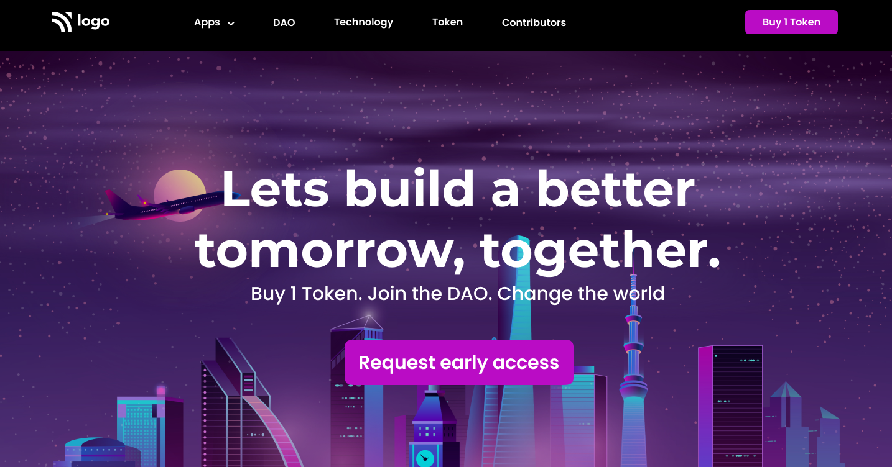

# Assignment 1

## Project 4 [Live Link](https://landing-page-crypto.netlify.app/)

-   Skills Gained in this project
    -   Learned to use css position [Relative & Absolute] property.
    -   Learned flex and its usage.
    -   Learned to use pseudo classes like **:nth-child()**, **:not()**, **:last-child**, **first-child**
    -   Learned using **::after** & **::before** pseudo elements.

---

## Time taken to finish this project

-   1.5 hours to complete it.

#### Screenshot

